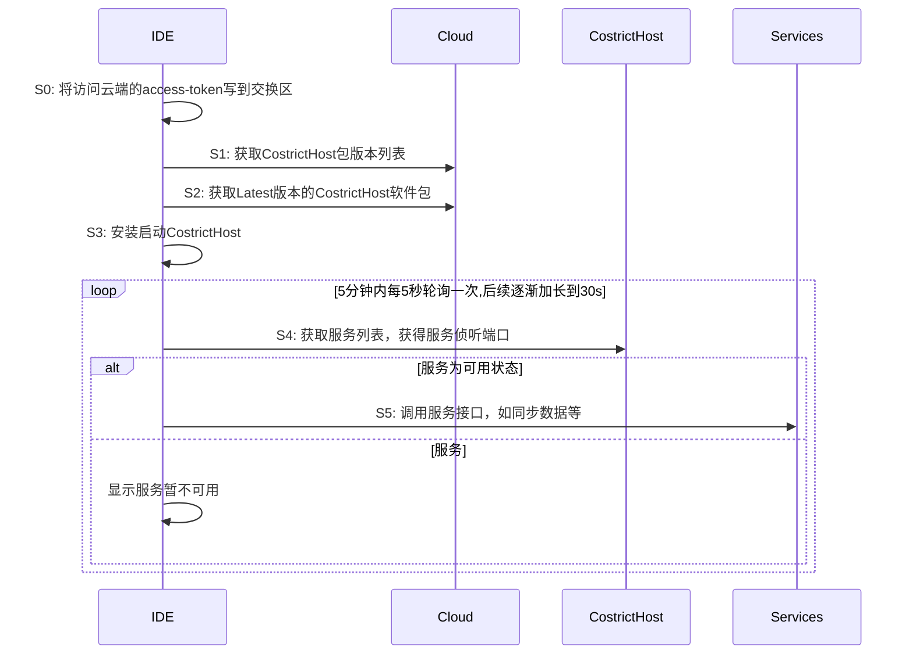

# 移动端命令行程序管理器(costrict-keeper)

## 1. 目的

在移动端，可能有多个服务，如果完全由vscode扩展进行管理，会让扩展变得复杂。

使用一个独立的命令行程序管理器，管理多个CLI程序的下载、安装、启动、配置、监控、服务注册，可以大大简化vscode扩展的复杂度。

## 2. 技术原理

costrict-keeper管理移动端可用的一系列的组件(component)，以及需要自动运行的各种服务(service)，维护一个高可用的移动端软件服务子系统(subsystem)。

costrict-keeper连接云端，获取各移动端的子系统定义文件，该文件描述了移动端软件服务子系统的构成以及管理方式。

* 组件：根据定义文件，costrict-keeper负责下载需要的各种组件，并维护这些组件的生命周期。
* 服务：根据定义文件，costrict-keeper负责启动各个服务，并监控服务的运行状态。

## 3. 整体方案

costrict-keeper启动后，从`https://zgsm.sangfor.com/costrict/subsystem/packages/packages-<os>-<plat>.json`获取子系统定义文件的版本列表。根据列表定义的版本，获取最新版本的软件服务子系统定义文件。

根据子系统定义文件，下载移动端需要的各种组件，启动需要自动启动的服务。

costrict-keeper提供可靠性、可调试性辅助机制。

1. 组件版本管理：定时获取各组件的版本列表，必要时更新组件。
2. 服务管理：根据用户请求(RESTful API)动态启停服务。
3. 服务接口管理：根据各服务公开的对外接口，生成`.well-known.json`，暴露所有运行中服务的接口
4. 可靠性：服务启动后，costrict-keeper监控服务的运行，保证服务正常运行。如果服务运行发生故障，costrict-keeper会自动重启服务。
5. 可调试性：costrict-keeper实现日志、事件、指标的上报，包括自动上报，手动上报等。

   - 日志上报：移动端各组件统一把日志保存在logs目录，由costrict-keeper统一上报到云端；
   - 事件上报：移动端各组件自行上报事件，如果上报失败，则把事件保存在events目录，由costrict-keeper定时尝试上报；
   - 指标上报：移动端各组件统一实现/metrics接口，costrict-keeper定时从各个组件采集指标，通过pushgateway上报到prometheus。

## 4. 结构设计

### 4.1. subsystem

子系统定义文件(subsystem.json)格式：

```json
{
    "configuration": "1.0.0",   //配置文件格式的版本
    "platform": "windows",      //配置文件适用的平台
    "arch": "amd64",            //配置文件适用的平台
    "version": "1.2.0",         //配置描述的软件包的版本，即构建出来的windows子系统的版本
    "manager": {                //服务管理器本身
        "name": "costrict-keeper",
        "version": "^1.0.0",
        "upgrade": {
            "mode": "auto",     //升级模式
            "lowest": "1.0.1",  //最低版本，当前版本低于该版本，强制升级到该版本
            "highest": "1.2.3"  //最高版本，超过该版本不自动升级
        }
    },
    "components": [{            //需要costrict-keeper管理的组件&服务程序
        "name": "codebase-syncer",  //程序名称
        "version": "^1.0.0",    //可支持版本范围
        "upgrade": {
            "mode": "auto",     //升级模式
            "lowest": "1.0.1",  //最低版本，当前版本低于该版本，强制升级到该版本
            "highest": "1.2.3"  //最高版本，超过该版本不自动升级
        }
    }, {
        "name": "codebase-indexer",
        "version": "^1.1.0"
    }, {
        "name": "codebase-parser",
        "version": "~1.1.1"
    }, {
        "name": "chisel",
        "version": "~1.0.0"
    }, {
        "name": "tunnel-client",
        "version": "~1.0.0"
    }, {
        "name": "cleaner",
        "version": ">=1.1.0"
    }],
    "services": [{              //需要costrict-keeper管理的服务
        "name": "codebase-syncer",  //程序名称
        "startup": "always",        //启动模式：always=常驻, once=运行一次, none=不自动运行
        "command": "codebase-syncer -s",//设定启动的命令行(比如服务模式启动codebase-syncer),如果不指定，则以不带参数方式启动
        "protocol": "http",         //服务对外接口协议
        "port": "8080",             //建议服务端口，实际运行时根据客户端情况会调整
        "metrics": "/metrics",      //指标采集接口的地址
        "accessible": "local"       //可访问性：remote(远程访问)/local(本地访问)
    }, {
        "name": "codebase-indexer",
        "startup": "always",
        "protocol": "http",
        "port": "8081"
    }, {
        "name": "codebase-parser",
        "startup": "always",
        "protocol": "http",
        "port": "8082"
    }, {
        "name": "tunnel-client",
        "startup": "always"
    }, {
        "name": "cleaner",
        "startup": "once"
    }]
}
```

### 4.2. Service

服务对象(Service)序列化为JSON后格式如下：

```json
{
    "name": "tunnel-client",
    "version": "1.1.0",
    "installed": true,
    "startup": "always",
    "status": "running",        //norun(未运行) -> running(运行中) -> stop(停止中) -> norun(未运行)
    "protocol": "http",         //服务对外接口协议
    "port": "8080"              //服务端口
}
```

### 4.3. Component

组件对象(Component)序列化为JSON后格式如下:

```json
{
    "name": "tunnel-client",
    "version": "1.1.0",
    "installed": true
}
```

### 4.4. SystemKnownledge

SystemKnownledge保存软件服务子系统的各项参数，该数据结构默认序列化为`%APPDATA%/.costrict/share/.well-known.json`

```json
{
    "logs": {
        "dir": "%APPDATA%\\.costrict\\logs",
        "level": "INFO"
    },
    "services": [{
        "name": "tunnel-client",
        "version": "1.1.0",
        "installed": true,
        "startup": "always",
        "status": "running"     //norun(未运行) -> running(运行中) -> stop(停止中) -> norun(未运行)
    }],
    "interfaces": [{
        "name": "tunnel-client",
        "version": "1.1.0",
        "protocol": "http",         //服务对外接口协议
        "port": "8080"              //服务端口
    }, {
        "name": "costrict-keeper",
        "version": "1.0.0",
        "protocol": "http",
        "port": "8081"
    }]
}
```

### 4.5. 移动端软件服务子系统数据存储区(Storage)

Storage是一个保存软件服务子系统数据的目录，位于`%APPDATA%/.costrict`。

其结构如下：

```
.costrict-+-/bin:  可执行文件区
          +-/package: 包安装记录区
          +-/logs: 日志区
          +-/share: 交换区(共享数据区,vscode扩展与子系统的数据交换)
          +-/cached: 运行状态区(缓存costrict-keeper管理的组件&服务的状态，保证服务和CLI可以并发工作，无惧程序崩溃)
```

## 5. 接口

### 5.1. RESTful API接口

costrict-keeper可以作为服务进行启动，通过RESTful API对外提供服务。

#### 5.1.1. 组件管理接口

升级指定组件：

```
POST /costrict/api/v1/components/{component}/upgrade?version=1.1.0
```

卸载组件：

```
DELETE /costrict/api/v1/components/{component}
```

获取组件列表：

```
GET /costrict/api/v1/components
```

#### 5.1.2. 服务管理接口

##### 5.1.2.1. 启动服务

```
POST /costrict/api/v1/services/{service}/start
```

##### 5.1.2.2. 停止服务

```
POST /costrict/api/v1/services/{service}/stop
```

##### 5.1.2.3. 重启服务

```
POST /costrict/api/v1/services/{service}/restart
```

##### 5.1.2.4. 获取服务列表

```
GET /costrict/api/v1/services
```

##### 5.1.2.5. 获取服务信息(状态&地址等)

```
GET /costrict/api/v1/services/{service}
```

##### 5.1.2.6. 修改服务参数

```
PUT /costrict/api/v1/services/{service}
```

```
PATCH /costrict/api/v1/services/{service}
```

### 5.2. 命令行接口

costrict-keeper可以通过命令行方式调用，以非交互的方式，执行子命令。

costrict-keeper执行的子命令，包括作为服务启动，升级组件，启停服务，上报日志，上报prometheus指标，生成服务`.well-known`文件。

#### 5.2.1. 作为HTTP服务器启动

```sh
costrict server --listen 8080 --config appdata/costrict.json
```

#### 5.2.2. 升级组件

```sh
costrict upgrade codebase-syncer --version 1.2.1
```

#### 5.2.3. 启停服务

```sh
costrict service start codebase-syncer
```

```sh
costrict service stop codebase-syncer
```

```sh
costrict service restart codebase-syncer
```

#### 5.2.4. 生成服务.well-known.json文件

```sh
costrict service status --output ./service-statuses.json
```

output未指定，则默认保存到`%APPDATA%/.costrict/share/.well-known.json`

#### 5.2.5. 上报日志

采集并打包日志：

```sh
costrict logs save --output costrict-logs.zip 
```

根据配置中的日志目录，将该目录下的所有日志文件打包，输出为output参数指定的压缩包文件。

采集并上传日志：

```sh
costrict logs upload [--addr upload-logs-addr]
```

根据配置中的日志目录，将该目录下的所有日志文件打包，将打包后的日志上传到costrict云端。

接收上报日志的API地址，由命令行参数addr指定，如果没有指定，从配置文件logs.addr中获取。

#### 5.2.6. 上报指标

```sh
costrict metrics [--addr pushgateway-api-addr]
```

根据各服务配置的metrics接口，采集指标数据，并合并上报给pushgateway。

pushgateway提供的上报地址，从命令行参数中获取，如果命令行参数没指定，则从配置文件metrics.pushgateway中获取。

## 6. 流程设计

### 6.1. vscode扩展与costrict-keeper交互



说明：

| 步骤 | 步骤逻辑 | 说明 |
|----|----|-----|
| S0 | 将访问云端的access-token写到交换区 | 保存到`%APPDATA%/.costrict/share/access-token` |
| S1 | 获取CostrictHost包版本列表 | URL: `https://zgsm.sangfor.com/costrict/costrict-keeper/packages/packages-<os>-<plat>.json`|
| S2 | 获取Latest版本的CostrictHost软件包 | 根据`packages-<os>-<plat>.json`中的URL获取包描述文件以及包数据文件（做法和上一版本相同） |
| S3 | 安装启动CostrictHost | 需要校验包的合法性（做法和上一版本相同） |
| S4 | 获取服务列表，获得服务侦听端口 |获取服务列表有两种方法：RESTful接口，或直接读取`%APPDATA%/.costrict/share/.well-known.json`文件<br/>服务列表即Service的数组，Service数据格式参考：`4.2. Service`。<br/>CostrictHost本身的接口也在`.well-known.json`中可查 |

